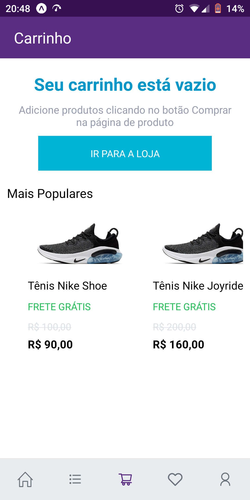
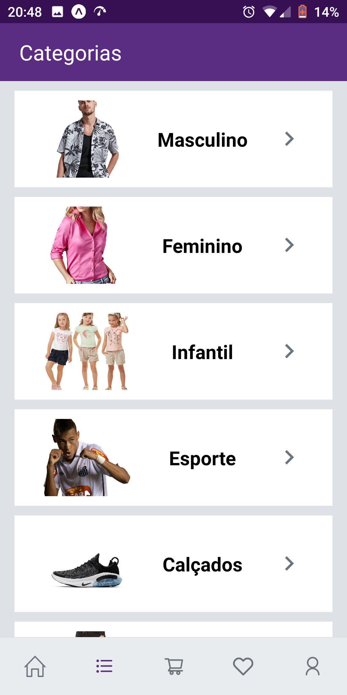
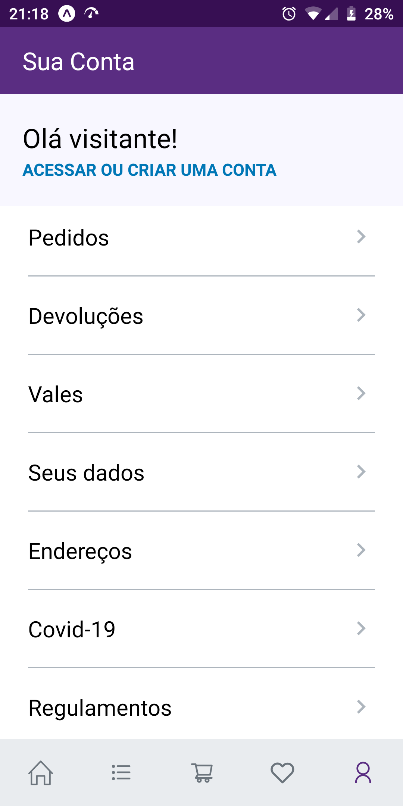

# Cópia da interface do aplicativo netshoes :iphone: :mans_shoe:

## Este projeto tem como objetivo fazer uma réplica da interface do aplicativo netshoes. Algumas das características deste projeto procuram aproximá-lo do original, por isso algumas coisas estarão com um mínimo de diferença.

## A arquitetura adotada para este projeto é baseada inteiramente nos ensinamentos da equipe Rocketseat. A pasta principal que contém os arquivos que modelam este projeto está no src. Esta pasta contém as seguintes pastas:

### - @types
### - assets
### - components
### - data
### - routes
### - screens

## Este projeto contém as telas principais do aplicativo original:

### - Home: 

### - Carrinho:

### - Categorias:

### - Lista de Desejos:

### - Sua conta:

